# Coding CircuitPython with AI Agent: The Easiest Setup

*A tutorial on a full AI agent workflow with **CircuitPython Online IDE***

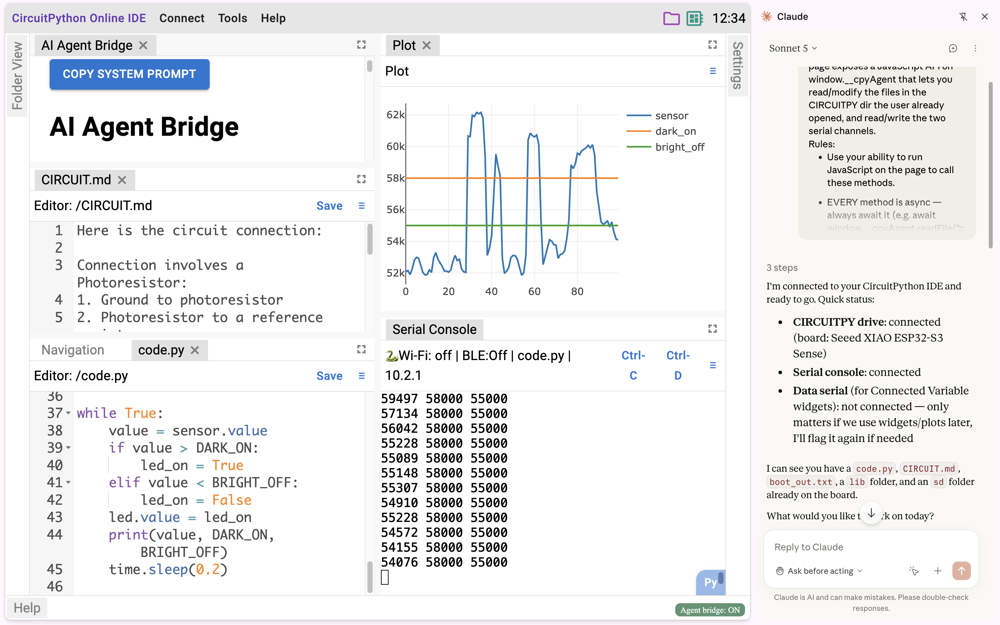

*Disclosure: The author of this post is the developer of CircuitPython Online IDE.*

## Background: Current State of AI Agent workflow for CircuitPython

The trend of AI-assisted coding is already affecting how we code for microcontrollers. [It is easy to ask LLM (Large Language Model) chatbots questions about CircuitPython and copy the code snippets to the microcontroller.](https://medium.com/@gene.arnold/%EF%B8%8F-building-a-simon-says-game-with-chatgpt-and-a-raspberry-pi-pico-1806f3314e8b) And if there are any errors, we naturally paste the error message from the REPL back to the chatbot. [Some chat environments went one step further and can interpret CircuitPython code](https://adafruit-playground.com/u/dexter_starboard/pages/circuitpython-and-chatgpt-code-interpreter), but they are still blind to real hardware such as sensors and motors.

AI coding **agents**, on the other hand, have changed how software gets written. As CircuitPython lead developer Scott Shawcroft put it in his [#CircuitPython2026 post](https://blog.adafruit.com/2026/01/14/scotts-circuitpython2026), LLMs used by a client-side agent that "can run commands and relay back the result in a loop" are game changing. He then envisioned the upcoming trend for the CircuitPython workflow: "we need to create the 'agentic' feedback loop for best results. We let the LLM auto-load code and give it the serial output back. We should also give it context about recent CircuitPython changes and API references so it can correct its knowledge."

The **full agent workflow** Scott described isn't new. Experts have been giving agents real hardware access for a while ([ohararp-g's Reddit post](https://www.reddit.com/r/circuitpython/comments/1ollo56/comment/o1pzbz0/) is one example), typically through the Model Context Protocol (MCP). But that power comes with setup work: installing and configuring MCP servers for code, the REPL, libraries, and more. That's a fine trade for a professional dev environment. It's a steep ask for learners and hobbyists.

What people have been asking for is an easy way to get access to the coding agent for CircuitPython in seconds. That's the gap closed by the AI Agent Bridge feature of CircuitPython Online IDE (https://circuitpy.dev).

## What is AI Agent Bridge?

To be clear, the IDE itself doesn't contain any AI. Instead, it exposes a set of tools, implemented as JavaScript functions, that an AI agent can call. These functions serve as the bridge between the IDE and the agent.

This means the agent also needs to live inside the browser. The agent we're going to use is Claude in Chrome.

## Prerequisites

- **Google Chrome** with the [Claude in Chrome extension](https://chromewebstore.google.com/detail/claude/fcoeoabgfenejglbffodgkkbkcdhcgfn) installed.
- A **Claude subscription** that includes Claude in Chrome.
- A CircuitPython-compatible board.

Note that everything runs in the browser, so there is nothing to install or configure on your local computer.

## Example 1: Night Light on Breadboard

In this example, I'm going to show how to use the AI Agent Bridge feature from start to finish to build a simple night light project.

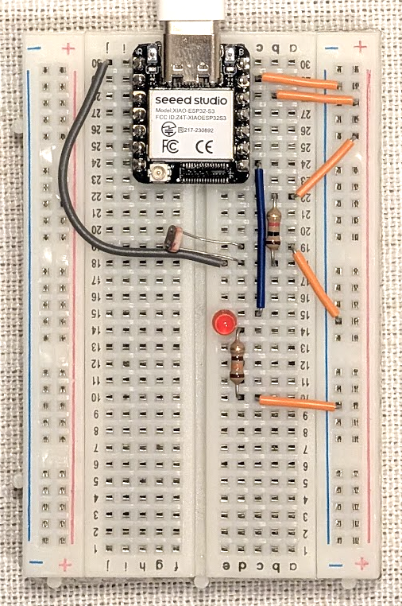

### Step 1: Set Up the IDE

With the Claude in Chrome extension already installed, we first open https://circuitpy.dev in Chrome. This loads the CircuitPython Online IDE as a website.

Next, we follow the instructions in the navigation tab. The first step is to connect the CircuitPy drive, which is the microcontroller's mass storage. The second step is to connect the serial console, after which you will see a greeting message. These are the same setup steps every time you use the Online IDE.

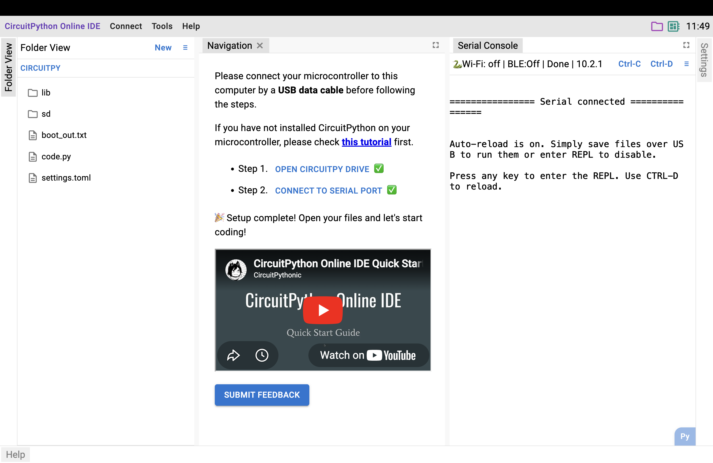

To use the AI Agent Bridge, open Tools -> AI Agent Bridge and click the button to turn it on. An indicator will appear in the bottom right corner showing that the Agent Bridge is on.

The final step is to open the Claude in Chrome extension, which brings up the chat interface on the right side.

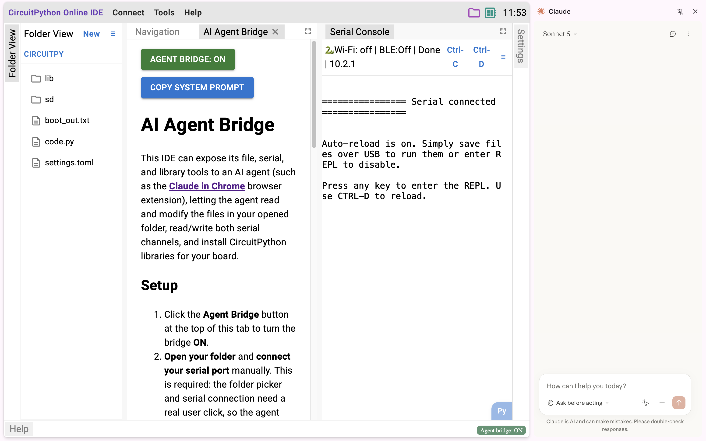

### Step 2: Document the pin connections

Claude in Chrome is a general-purpose agent, so it doesn't know what hardware we are working with. We need to tell it how the circuit is connected. Since the circuit rarely changes, the best place to document it is a markdown file stored on the microcontroller itself.

In this project, the breadboard holds a microcontroller, a photoresistor, and an LED.

Let's create a file called `CIRCUIT.md` in the board's root:

```markdown
Here is the circuit connection:

Connection involves a Photoresistor:
1. Ground to photoresistor
2. Photoresistor to a reference resistor
3. Reference resistor to VCC
4. The shared node between the photoresistor and the reference resistor is connected to the microcontroller at D0.

Connection involves an LED:
1. From the microcontroller, it is connected to the LED on microcontroller pin D7.
2. After the LED, there is a resistor, which is then connected to ground.
```

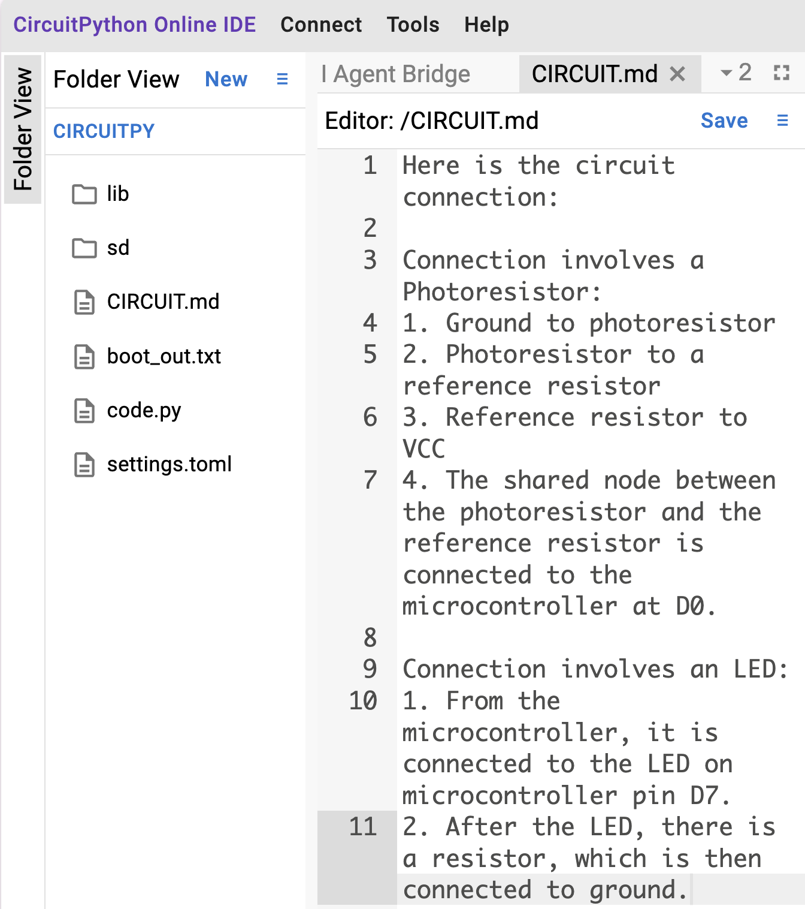

### Step 3: Copy and run the system prompt

Besides the circuit, the agent also needs to know what kind of project we are working on (CircuitPython): how to call the IDE's tools, to check its connection first, to experiment in the REPL before writing files, to install libraries from the board's CircuitPython bundle, and to read the plotting guide before drawing plots. This information is the same every time you work with the AI Agent Bridge, so I have already written a system prompt for you to copy.

Click **Copy System Prompt** in the Agent Bridge tab, and paste it into the Claude side panel in Chrome. You only do this once per conversation.

After it reads this system prompt, the agent will confirm your setup and ask what you'd like to build.

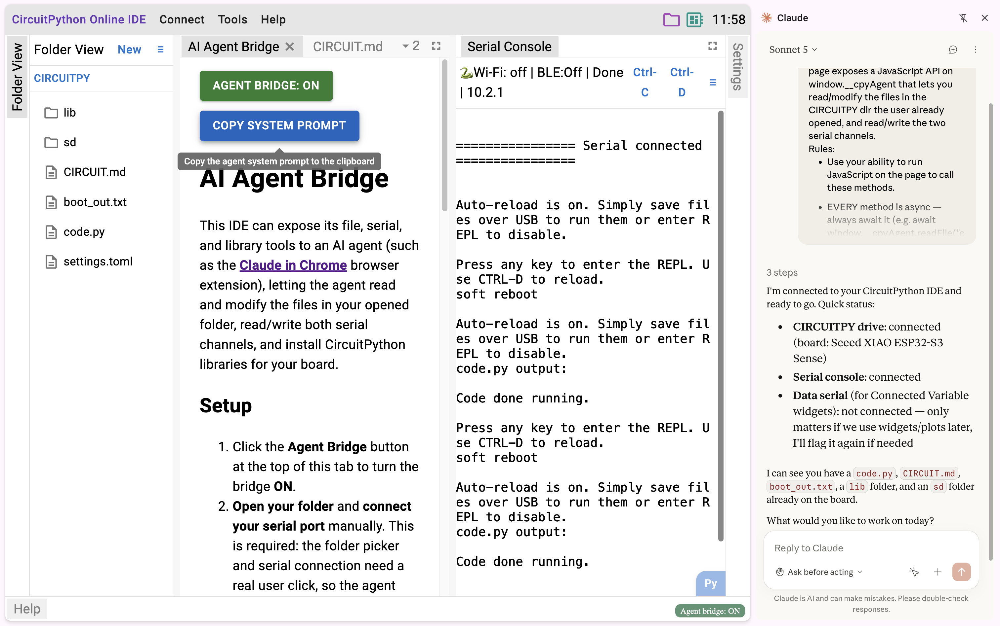

### Step 4: Build the night light

Time to build something real: **a night light**. 

Prompt:
> Build a nightlight that will turn on the LED when the photoresistor is in the dark. Turn it off when it is bright.

The agent then started running experiments in the REPL. It tested the LED connection and checked what the photoresistor reading looks like at normal room brightness.

```text
>>> exec("""import board, analogio, digitalio\nprint(hasattr(board,'D0'), hasattr(board,'D7'))""")
True True
>>> exec("""sensor = analogio.AnalogIn(board.D0)\nled = digitalio.DigitalInOut(board.D7)\nled.direction = digitalio.Direction.OUTPUT\nprint('setup done')""")
setup done
>>> exec("""led.value = True\nprint('LED ON', sensor.value)""")
LED ON 54989
```

Then it asked me to cover the photoresistor so it could measure the reading in the dark.

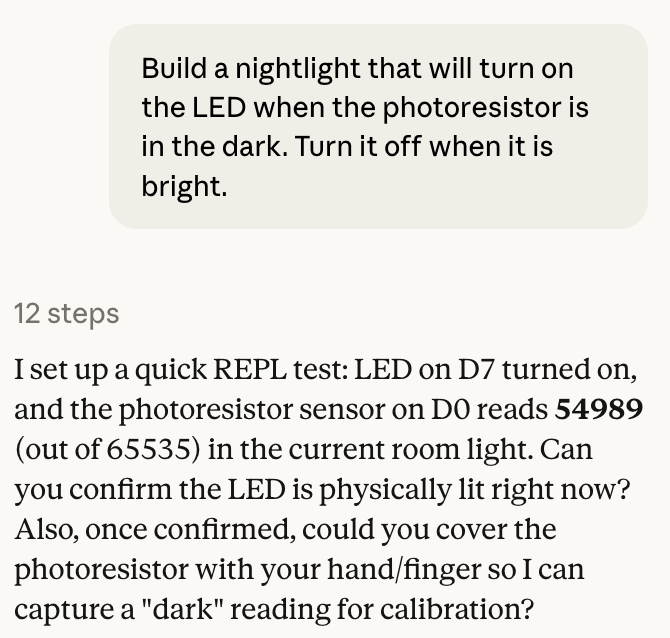

I covered the photoresistor and gave it another prompt.

Follow-up prompt:
> The photoresistor is covered. Can you read it again?

It ran the experiment again:

```
>>> exec("""print('dark reading', sensor.value)""")
dark reading 62436
>>> exec("""led.value = False\nprint('led off')""")
led off
```

Then it asked me to help gather more data so it could set the thresholds.
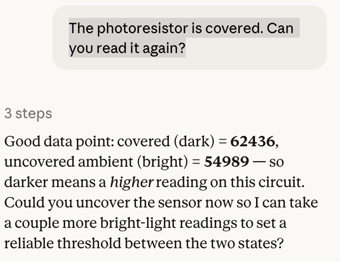

Follow-up prompt:
> It is uncovered now.

```
>>> exec("""for i in range(5):\n    print('bright reading', sensor.value)""")
bright reading 50859
bright reading 51037
bright reading 50720
bright reading 50164
bright reading 49886
>>> exec("""import time\nDARK_ON = 58000\nBRIGHT_OFF = 55000\nstate = False\nfor i in range(20):\n    v = sensor.value\n    if v > DARK_ON:\n        state = True\n    elif v < BRIGHT_OFF:\n        state = False\n    led.value = state\n    print(v, state)\n    time.sleep(0.5)""")
50739 False
51276 False
50819 False
50064 False
49866 False
49687 False
50303 False
51018 False
50938 False
50958 False
50183 False
49786 False
49866 False
50461 False
51315 False
62258 True
62337 True
49032 False
48634 False
48773 False
>>> 
soft reboot

Auto-reload is on. Simply save files over USB to run them or enter REPL to disable.
code.py output:
```

After gathering enough data points, it confidently wrote code.py and ran the final code. It then asked me to confirm that the code was working.

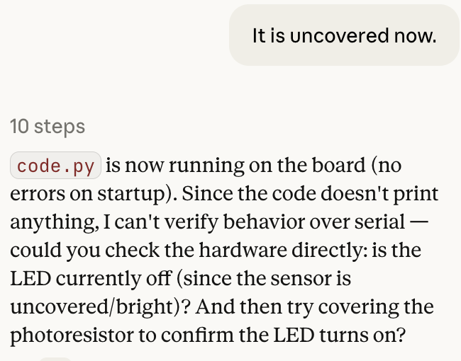

As tested, the night light works as expected. When my hand covers the photoresistor, the LED turns on; when I remove my hand, it turns off.
Reading the code it wrote, I found it used hysteresis (two separate thresholds) to keep the LED from flickering on and off near the boundary, which is smart.

### Step 5: The agent plots your data, right in the IDE

Follow-up prompt:
> It is working now, and I want you to make a plot out of the sensor data and the two thresholds. Only keep 100 history data in this plot.

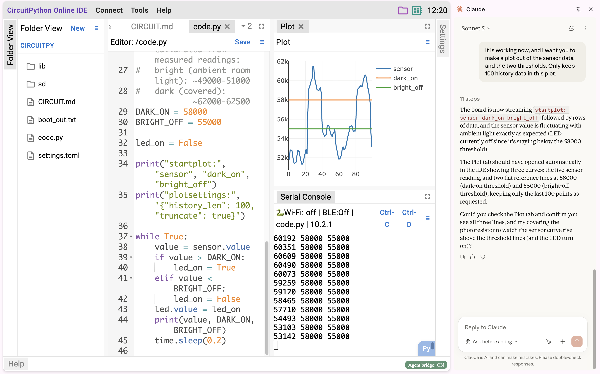

The agent read the IDE's plotting guide through the bridge, then updated the code to print the sensor readings in the IDE's plot format. The IDE's built-in serial plotter picked it up immediately, showing a live, scrolling graph of the room's brightness.

### Conclusion

This first example confirms that the agent can:
- check the latest CircuitPython documentation
- run experiments in the REPL
- write CircuitPython code
- use the IDE's tools, including the plotter

## Example 2: M5Stack CardPuter Calculator

The M5Stack CardPuter is a fun development board with a built-in keyboard and screen, so this time I didn't connect any external peripherals. The goal was to turn it into a pocket calculator using only what's on the board.

This example is a harder test than it looks. Unlike Example 1, there was no `CIRCUIT.md` this time: I deliberately didn't tell the agent how the keyboard or the screen is connected, so it had to find the board's documentation on its own. On top of that, the screen doesn't work out of the box; it needs a display driver library that wasn't on the board yet.

I started from a blank project and built the whole thing with just two prompts:

Prompt:
> Make a calculator using the keyboard and screen on this board. The number keys are used for entering a number, and support plus, minus, multiply, and divide. Enter to submit.

Follow-up prompt:
> I want to support additional keys for the operations:
> - A for add
> - M for minus
> - X for multiply
> - D for divide

The result is a fully functional calculator. Along the way, the agent looked up the CardPuter's documentation to learn how the onboard keyboard is wired, worked out how to capture keystrokes, picked the right display drivers (`adafruit_display_text`, `adafruit_bitmap_font`, `adafruit_ticks`), and installed it with the IDE's library management tool.

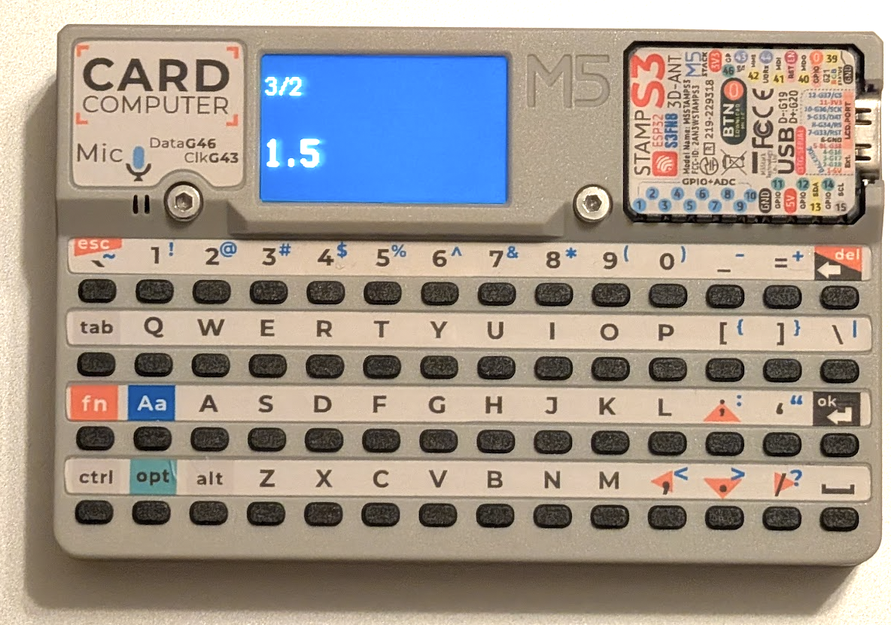

This example confirms that the agent can:
- check external documentation for a specific board to learn its peripheral connections
- install the latest versions of the necessary libraries using the IDE's library management tool

<<<<<<< Updated upstream
=======
## Example 3: Maintain previous Project

I have a macropad project that is running on a previous version of CircuitPython.
After upgrading to the recent version, it breaks immediately


Prompt
> This project is upgraded to the latest version of CircuitPython, so many things are broken. I want you to do the following things:
> First, GamePad is no longer an Adafruit library, so please remove everything related to GamePad.
> Second, upgrade all the libraries to the latest version.
> Third, if any part of the code is broken in this major version upgrade, please fix it.

Agent's response

Here's what I did:

**1\. Removed GamePad entirely**

-   `boot.py`: deleted the custom `GAMEPAD_REPORT_DESCRIPTOR` and the `gamepad` USB HID device, leaving only keyboard/mouse/consumer-control enabled.
-   `macropad.py`: removed the `from adafruit_hid.gamepad import Gamepad` import, the `Limit` helper class (only used for joystick clamping), `self.gamepad`/`self.gamepad_states`, and all the `GAMEPAD_BUTTON`/`JOY_ALTER`/`JOY_SET`/`JOY_CENTER` branches in `press_code`/`release_code`/`__call__`.
-   Checked `settings.json` --- none of your configured macros actually used any gamepad/joystick codes, so nothing in your key layout is lost.

**2\. Upgraded libraries** to the latest versions for CircuitPython 10.2.1 (via `installLib`, no failures):\
adafruit_bitmap_font 2.3.1→2.4.2, adafruit_display_text 3.3.3→5.0.4, adafruit_displayio_ssd1306 3.0.3→3.0.6, adafruit_hid 6.1.7→6.1.10, adafruit_ticks 1.1.4→1.1.7 (pulled in as a dependency).

**3\. Fixed breakage from the CircuitPython major-version upgrade**, verified each fix live in the REPL before writing to files:

-   `boot.py` was actually already crashing at boot (per `boot_out.txt`): `supervisor.disable_autoreload()` no longer exists --- replaced with `supervisor.runtime.autoreload = False`.
-   `displayio.I2CDisplay` was removed --- replaced with `i2cdisplaybus.I2CDisplayBus`.
-   `display.show(group)` now raises `.show(x) removed. Use .root_group = x` --- replaced with `display.root_group = self.splash`.
-   Along the way I also caught and fixed a pre-existing bug of my own: I initially mis-transcribed a multi-line expression in `macropad.py` and dropped a closing parenthesis, causing a `SyntaxError`. Caught it immediately when testing and corrected it.

I then ran `code.py` on the board (`ctrlD()`), and it booted cleanly with no exceptions --- printed `Hello!` and settled into the main loop with no errors on serial since.

Since serial only shows program output, not the physical hardware, could you confirm on the device itself: is the OLED display showing the layer text (not blank/frozen), and do the keys/encoder respond as expected when you press them or turn the knob?

Prompt
> OLED working well and I can tested macrokeys working well. Now please inspect the code, and write a CIRCUIT.md to document the PIN connections.

Great to hear the display and macro keys are working. I've written `CIRCUIT.md` to the CIRCUITPY drive, documenting the wiring based on what's actually in `code.py`/`macropad.py`, cross-checked against the XIAO RP2040's real pin aliases (I confirmed these live via the REPL, e.g. `D9` maps to silkscreen `MISO`, `D6` to `TX`, etc.):

-   **OLED (SSD1306 128x32, I2C @ 0x3C):** SDA→`board.SDA`, SCL→`board.SCL`, plus 3.3V/GND.
-   **7 macro key switches** (each wired pin-to-GND, using internal pull-ups, active-low): key 0→D10 (MOSI), key 1→D6 (TX) --- these two are the momentary layer-select buttons --- key 2→D3 (A3), key 3→D2 (A2), key 4→D1 (A1), key 5→D0 (A0), and key 6→D9 (MISO), which is the rotary encoder's push button.
-   **Rotary encoder:** A→D8 (SCK), B→D7 (RX), with rotation producing virtual key numbers 7/8 in software (no extra pins).
-   **USB** for power and the keyboard/mouse/consumer-control HID interface.

One caveat I noted in the doc: the "lower row"/"upper row" grouping is based on the inline comments in `code.py` rather than something I could verify physically, so it's worth double-checking against your actual enclosure if it seems off.

Let me know if you'd like anything else --- for example, a wiring diagram image, or further cleanup/documentation of `configure.py`'s macro format.

Prompt
> There is module called usb_video. I want you to stream OLED content through usb_video

I found the module and its docs. Here's how it works: `usb_video.enable_framebuffer(width, height)` must be called in `boot.py` (framebuffer allocation happens at boot, and it can't be changed at runtime --- I confirmed this by getting `'Cannot change USB devices now'` when trying it from the REPL). Then in `code.py` you wrap `usb_video.USBFramebuffer()` in a `framebufferio.FramebufferDisplay`, and use ordinary `displayio` Groups/Labels with it, exactly like the OLED.

Given that, my plan to mirror the OLED content is:

-   Add `usb_video.enable_framebuffer(128, 32)` to `boot.py` (matching the OLED's own 128×32 resolution, so it's a genuine mirror, not a rescale).
-   Add a small `MultiDisplay` helper in `macropad.py` that forwards `show_layer_text`/`show_macro_text`/`show_layer`/`show_macro` calls to a list of display wrappers --- so I can drive two independent `MONO_128x32` instances (one on the physical OLED, one on the USB video framebuffer) with identical content, without needing to hack displayio internals.
-   Update `code.py` to build the USB video display and combine it with the OLED display via `MultiDisplay`.

One important catch: `boot.py` changes only take effect after a **hard reset** (unplug/replug the board, or press its physical reset button) --- `ctrlD()`/soft-reload won't apply it, and afterward you'll need to manually reconnect the serial port in the IDE, since I can't do that myself.

Shall I proceed with these changes? I'll make the edits now, then let you know when it's time to hard-reset and reconnect.

> proceed

All three files are updated and saved:

-   **`boot.py`** --- added `usb_video.enable_framebuffer(128, 32)` to allocate the UVC framebuffer at boot, matching the OLED's resolution.
-   **`macropad.py`** --- added a `MultiDisplay` helper class that forwards `show_layer_text`/`show_macro_text`/`show_layer`/`show_macro` calls to a list of display wrappers.
-   **`code.py`** --- now creates a second `MONO_128x32` instance backed by `framebufferio.FramebufferDisplay(usb_video.USBFramebuffer())`, and combines it with the OLED's display wrapper via `MultiDisplay`, so both get identical content.

Since `boot.py` only takes effect on a hard reset, could you please **unplug and replug the board (or press its physical reset button)**, then **reconnect the serial port in the IDE**? Once you let me know it's reconnected, I'll check `boot_out.txt` for any errors (like a memory or USB-endpoint problem) and verify the video framebuffer initializes correctly before we test the mirrored output.

> hard reset done

>>>>>>> Stashed changes
## You can also try

In my personal projects, I have also used the agent for the following kinds of tasks, which you can use for inspiration:
- Explain the code of a large existing CircuitPython project to me.
- Review the code of an existing project, find issues, and fix them.
- Fix code issues caused by upgrading CircuitPython to a newer major version, along with all the library dependencies.
- Make animations, not just plots, using the IDE's plot tool driven by changing sensor data.


## Q&A

### Who is this for?

- **Beginners** can treat the AI as a patient teacher. Ask it to explain every line it writes, ask "why did that error happen," ask for a gentler version. It has your actual board and your actual output in front of it, so its explanations are grounded, not generic.
- **DIYers and makers** can finish the project without going deep into code. Describe the behavior you want; the agent handles pin setup, library installation, and debugging, and you verify the result on the bench.
- **Experts** get a fast lane for prototyping. Sketch an idea against real hardware in minutes. To be clear about the limits: for large-scale, multi-file software projects, a dedicated coding agent like Claude Code is still the right tool. The Bridge is for the hardware-in-the-loop part of your work, not a replacement for your main development environment.

### How is this different from copying code from a chatbot?


A chatbot **gives answers**; an agent **does work**. With a chatbot, *you* are the LLM's hands: you paste code, run it, read the traceback, paste it back, repeat, and every round trip loses context. With the Agent Bridge, the agent runs the loop itself: it tests assumptions in the REPL, reads the real sensor values, sees the real error with full context, and fixes it.

### Is this safe?

Two layers, by design:

1. **Chrome's permission model guards the doors.** In the very first step of the IDE setup, we open the microcontroller's specific folder and connect to its specific serial port. The bridge passes only these to the agent, so they are the only things on your computer the agent can see. It never reaches the rest of your computer.

2. **The IDE's backup tool is your undo button.** Before an agent session, use the IDE's built-in backup to snapshot your board's files. If an experiment goes sideways, restore and try again. 

### Why Claude in Chrome?

I evaluated AI agent Chrome extensions against the following criteria:
- a first-party extension, for security and so there are no auth tokens to manage
- able to run JavaScript commands on the website
- good at programming

At the time of writing, Claude in Chrome is the only one that satisfies all three. If you find a third-party extension or AI browser that you trust, feel free to try it: it will work the same way.

CircuitPython Online IDE has no control over subscriptions; those go through the AI model providers.

## Try it out now

[CircuitPython Online IDE](https://circuitpy.dev) is a powerful development tool for CircuitPython. In addition to the Agent Bridge feature, it has a lot of other powerful features such as Library Management and a Debugger. The IDE itself is completely free and open source. Check it out at CircuitPy.dev.

---

*References: [Gene Arnold: Building a Simon Says Game with ChatGPT and a Raspberry Pi Pico](https://medium.com/@gene.arnold/%EF%B8%8F-building-a-simon-says-game-with-chatgpt-and-a-raspberry-pi-pico-1806f3314e8b) · [Dexter Starboard: CircuitPython and ChatGPT Code Interpreter](https://adafruit-playground.com/u/dexter_starboard/pages/circuitpython-and-chatgpt-code-interpreter) · [Scott's #CircuitPython2026](https://blog.adafruit.com/2026/01/14/scotts-circuitpython2026) · [ohararp-g on r/circuitpython: agents with hardware access over MCP](https://www.reddit.com/r/circuitpython/comments/1ollo56/comment/o1pzbz0/)*
